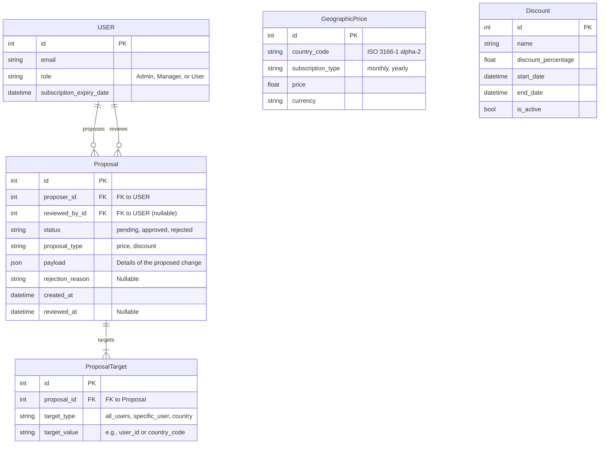
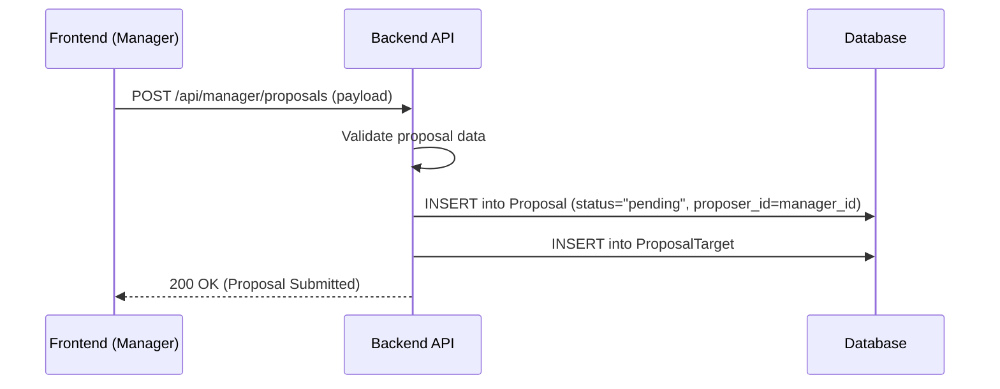
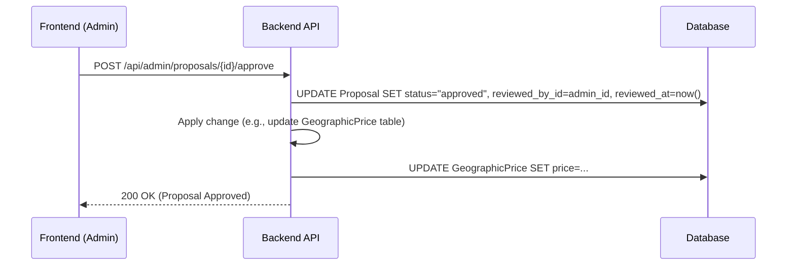
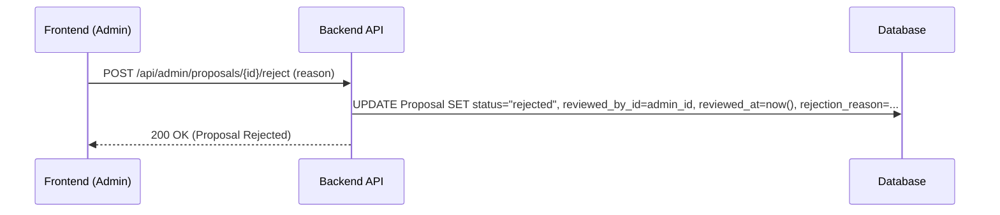

# **Admin & Pricing Management: Design Document**

## 1. Overview

This document outlines the technical design for a new administrative feature set within the Expense Tracker application. The primary goal is to introduce a robust system for Role-Based Access Control (RBAC), dynamic geographic pricing, discount management, and a formal proposal/approval workflow for pricing changes.

## 2. Core Requirements

-   **Role System:** Introduce three user roles: `Admin`, `Manager`, and `User`.
-   **Role Management:** Admins can assign or revoke the `Manager` role for any user.
-   **Dynamic Pricing:** Admins can set different subscription prices for various geographies.
-   **Discount Management:** Admins can create time-bound discounts.
-   **Proposal Workflow:** Managers can propose new prices or discounts for specific user segments.
-   **Approval System:** Admins must review all proposals and can either `approve` or `reject` them, creating a clear audit trail.

## 3. Role-Based Access Control (RBAC)

The system will be governed by the following role permissions:

-   **Admin:**
    -   Has all permissions of a Manager and User.
    -   Can assign/revoke Manager roles.
    -   Can directly set prices and discounts.
    -   Can approve or reject proposals from Managers.
-   **Manager:**
    -   Has all permissions of a User.
    -   Can create and submit proposals for price and discount changes.
    -   Can view the status of their own proposals.
-   **User:**
    -   Standard non-administrative user with access to core application features based on their subscription status (Premium/Free).

## 4. Proposed Architecture & Schema

### 4.1. Legend for Changes

-   **[+] Green / Bold**: Represents a new table or major component.
-   *[*] Blue / Italic*: Represents a modified table or an existing element with new logic.

### 4.2. Database Schema Diagram

The schema will be extended with new tables to manage roles, pricing, discounts, and proposals.

### 4.3. Detailed Table Definitions

-   **`User` (Modified):**
    -   `role`: A new string field to store the user's role (`"ADMIN"`, `"MANAGER"`, or `"USER"`).
-   **`GeographicPrice` (New):** Stores the base price for a subscription type in a specific country.
-   **`Discount` (New):** Stores promotional discounts that can be applied to subscription prices.
-   **`Proposal` (New):** The core of the workflow.
    -   `proposer_id`: The Manager who created the proposal.
    -   `reviewed_by_id`: The Admin who approved or rejected it.
    -   `status`: Tracks the proposal's lifecycle.
    -   `payload`: A JSON object containing the proposed changes (e.g., `{"country_code": "IN", "price": 4.99, "currency": "USD"}`).
    -   `rejection_reason`: A text field for the Admin to provide feedback on rejected proposals.
-   **`ProposalTarget` (New):** Defines the audience for a proposal, linking it to specific users or regions.

## 5. Backend API Design

A new set of role-protected API endpoints will be created.

### 5.1. Admin Endpoints (`/api/admin/*`)
-   `POST /users/{user_id}/assign-role`: Sets a user's role to `Manager`.
-   `GET, POST, PUT /pricing`: CRUD operations for the `GeographicPrice` table.
-   `GET, POST, PUT /discounts`: CRUD operations for the `Discount` table.
-   `GET /proposals`: Fetches all `pending` proposals for review.
-   `POST /proposals/{proposal_id}/approve`: Sets a proposal's status to `approved`, records the Admin's ID, and applies the change described in the `payload`.
-   `POST /proposals/{proposal_id}/reject`: Sets a proposal's status to `rejected`, records the Admin's ID, and stores the `rejection_reason`.

### 5.2. Manager Endpoints (`/api/manager/*`)
-   `POST /proposals`: Creates a new proposal with `pending` status.
-   `GET /proposals`: Fetches the status of proposals created by the current Manager.

### 5.3. Modified Endpoints
-   `GET /api/users/me`: Will now also return the user's `role`.
-   `POST /api/users/me/subscribe`: The pricing logic will be updated to query the `GeographicPrice` and `Discount` tables to calculate the final price for the user.

## 6. Frontend Architecture

A new "Admin Panel" will be created, accessible via a route like `/admin`.

-   **Conditional Rendering:** The link to the Admin Panel will only be rendered in the UI if the logged-in user's role is `ADMIN` or `MANAGER`.
-   **Component Breakdown:**
    -   `AdminLayout.js`: A wrapper for the admin section with role-specific navigation.
    -   `UserManagement.js`: (Admin only) A table of users with a button to promote/demote Managers.
    -   `PriceManagement.js`: (Admin only) A CRUD interface for geographic prices.
    -   `DiscountManagement.js`: (Admin only) A CRUD interface for discounts.
    -   `ProposalQueue.js`: (Admin only) A list of pending proposals with details and approve/reject buttons.
    -   `ProposalForm.js`: (Manager only) A form to create and submit a new proposal.
    -   `MyProposals.js`: (Manager only) A view to track the status of their submitted proposals.

## 7. Key Workflows (Sequence Diagrams)

### 7.1. Manager Proposing a New Price

### 7.2. Admin Approving a Proposal

### 7.3. Admin Rejecting a Proposal

