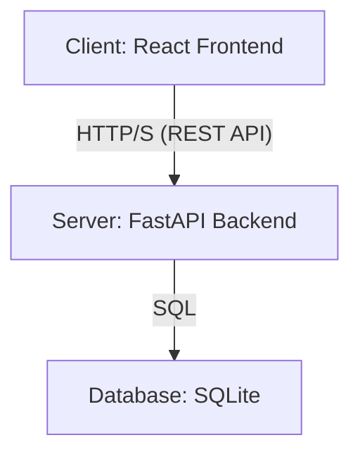
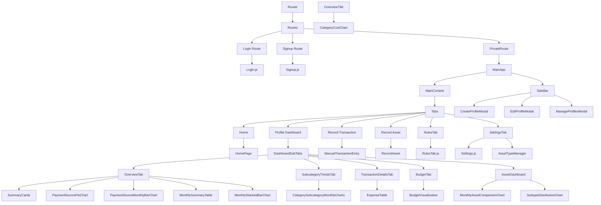
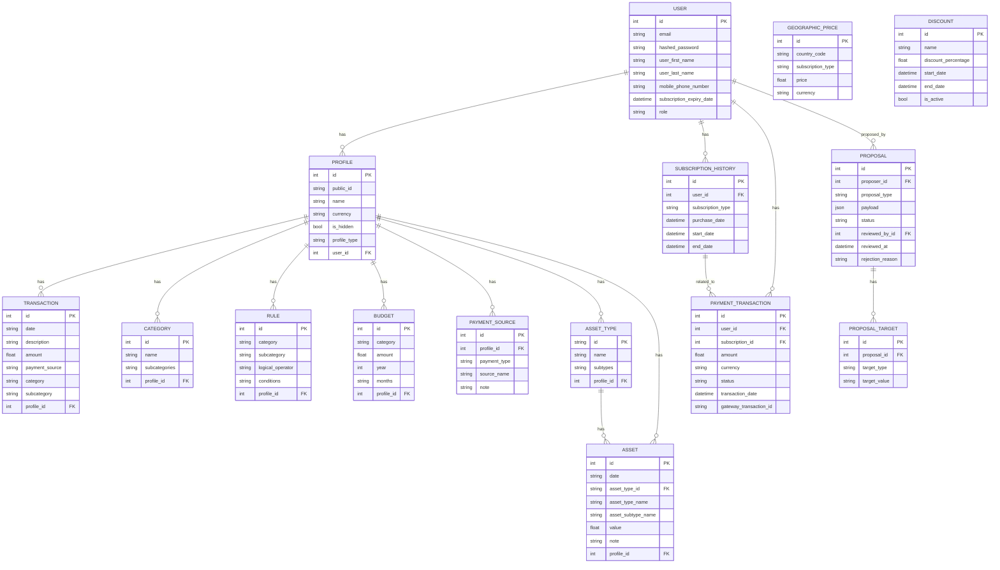

# Expense Tracker Architecture Document

This document provides a detailed overview of the architecture of the Expense Tracker application, including the frontend, backend, and data storage components.

## Table of Contents

- [1. Overview](#1-overview)
- [2. Overall Architecture](#2-overall-architecture)
- [3. Frontend Architecture](#3-frontend-architecture)
  - [3.1. Technology Stack](#31-technology-stack)
  - [3.2. Component Hierarchy](#32-component-hierarchy)
  - [3.3. Main Components](#33-main-components)
  - [3.4. Authentication Flow](#34-authentication-flow)
- [4. Backend Architecture](#4-backend-architecture)
  - [4.1. Technology Stack](#41-technology-stack)
  - [4.2. API Endpoints](#42-api-endpoints)
  - [4.3. Database Schema](#43-database-schema)
  - [4.4. Data Processing](#44-data-processing)
- [5. Data Migration](#5-data-migration)

## 1. Overview

The Expense Tracker is a web-based application designed to help users track their expenses and manage their personal finances. It consists of a React-based frontend for the user interface and a FastAPI-based backend for data processing and storage. The application supports managing multiple user profiles, tracking transactions, categorizing expenses, setting budgets, and managing financial assets.

## 2. Overall Architecture

The application follows a classic client-server architecture.

-   **Client (Frontend)**: A single-page application (SPA) built with React. It is responsible for all user interactions and data visualization.
-   **Server (Backend)**: A Python application built with FastAPI. It exposes a RESTful API that the frontend consumes. It handles business logic, data processing, and database interactions.
-   **Database**: A SQLite database is used for persistent storage. It stores all user data, including profiles, transactions, categories, rules, and assets.

## 3. Frontend Architecture

The frontend is a single-page application (SPA) built with React. It is responsible for rendering the user interface, handling user interactions, and communicating with the backend API.

### 3.1. Technology Stack

-   **React**: A JavaScript library for building user interfaces.
-   **React Router**: A library for handling routing in React applications.
-   **React Bootstrap**: A library of pre-built components for React, based on the Bootstrap framework.
-   **Chart.js & Recharts**: Libraries for creating interactive charts and data visualizations.
-   **Axios**: A promise-based HTTP client for making requests to the backend API.
-   **react-datepicker**: A reusable date picker component for React.

### 3.2. Component Hierarchy

The following diagram illustrates the main component hierarchy of the frontend application, including the new routing structure.

### 3.3. Main Components

-   **App.js**: The root component of the application. It sets up the routing structure (distinguishing between public and private routes) and contains the `MainApp` component, which manages the main state (profiles, transactions, settings) and the layout for authenticated users.
-   **Login.js**: A public component that provides a form for users to log in.
-   **Signup.js**: A public component that provides a form for new users to register.
-   **authService.js**: A utility module that encapsulates the logic for handling authentication-related API calls (login, signup, logout) and managing the user's authentication token in local storage.
-   **SideBar.js**: Displays the list of user profiles and allows users to create, edit, and delete profiles.
-   **HomePage.js**: The landing page of the application.
-   **AssetDashboard.js**: The main dashboard for the "Asset Manager" profile type. It displays a summary of assets and includes charts for visualizing asset data.
-   **MonthlyAssetComparisonChart.js**: A chart component that displays a monthly comparison of asset values, grouped by asset type.
-   **SubtypeDistributionChart.js**: A chart component that shows the monthly distribution of subtypes for a selected asset type.
-   **ManualTransactionEntry.js**: A form for manually adding new transactions.
-   **RecordAsset.js**: A form for recording new assets.
-   **ExpenseTable.js**: Displays a table of transactions with filtering and sorting capabilities.
-   **Settings.js**: Allows users to manage categories, subcategories, and payment sources.
-   **RulesTab.js**: Provides an interface for creating and managing transaction categorization rules.
-   **Chart Components**: Various components for data visualization, such as `PaymentSourcePieChart`, `MonthlyStackedBarChart`, `CategoryCostChart`, etc.

### 3.4. Authentication Flow

The authentication flow is designed to be secure and straightforward, using JWT (JSON Web Tokens) for authenticating users after the initial login.

1.  **User Registration**:
    -   A new user fills out the registration form in the `Signup.js` component.
    -   The frontend sends a `POST` request to `/api/users/signup` with the user's details (email, password, name).
    -   The backend validates the data, hashes the password, and creates a new user in the database.
    -   Upon successful registration, the user is redirected to the login page.

2.  **User Login**:
    -   The user enters their credentials in the `Login.js` component.
    -   The frontend sends a `POST` request to `/api/users/login` with the user's email and password.
    -   The backend verifies the credentials. If they are correct, it generates a JWT access token.
    -   The backend returns the access token to the frontend.

3.  **Token Storage**:
    -   The frontend stores the received access token in the browser's local storage. This token is used to authenticate subsequent API requests.

4.  **Authenticated Requests**:
    -   For any request that requires authentication, the frontend includes the access token in the `Authorization` header of the HTTP request (e.g., `Authorization: Bearer <token>`).
    -   The backend has a dependency (`get_current_active_user`) that verifies the token from the request header.
    -   If the token is valid, the backend proceeds with the request. If not, it returns a `401 Unauthorized` error.

5.  **Logout**:
    -   When the user logs out, the frontend removes the access token from local storage.
    -   This effectively ends the user's session, and they will need to log in again to access private routes.

## 4. Backend Architecture

The backend is a Python application built with the FastAPI framework. It provides a RESTful API for the frontend, manages the database, and handles all business logic.

### 4.1. Technology Stack

-   **FastAPI**: A modern, fast (high-performance) web framework for building APIs with Python 3.7+ based on standard Python type hints.
-   **SQLModel**: A library for interacting with SQL databases from Python code, with Python objects. It is designed to be compatible with FastAPI and Pydantic.
-   **Uvicorn**: An ASGI server for running the FastAPI application.
-   **Pandas**: A powerful data analysis and manipulation library, used for some data processing tasks.
-   **python-dotenv**: A library for managing environment variables.
-   **passlib**: A library for password hashing and verification.
-   **python-jose**: A library for encoding and decoding JSON Web Tokens (JWT).

### 4.2. API Endpoints

The backend exposes a variety of RESTful API endpoints for managing profiles, transactions, assets, and settings. Here is a summary of the main endpoints:

#### User and Authentication
-   **`POST /api/users/signup`**: Register a new user.
    -   **Request Body**: `UserCreate` model (`email`, `password`, `user_first_name`, `user_last_name`, `mobile_phone_number`).
    -   **Response**: `User` model.
-   **`POST /api/users/login`**: Authenticate a user and get an access token.
    -   **Request Body**: `OAuth2PasswordRequestForm` (`username`, `password`).
    -   **Response**: `Token` model (`access_token`, `token_type`).
-   **`GET /api/users/me`**: Get the details of the currently authenticated user.
    -   **Response**: `UserResponse` model.
-   **`PUT /api/users/me`**: Update the details of the currently authenticated user.
    -   **Request Body**: `UserUpdate` model.
    -   **Response**: `UserResponse` model.
-   **`PUT /api/users/me/password`**: Change the password for the currently authenticated user.
    -   **Request Body**: `PasswordReset` model.
-   **`POST /api/users/me/subscribe`**: Subscribe the user to a premium plan.
    -   **Request Body**: `SubscriptionCreate` model.
    -   **Response**: `UserResponse` model.
-   **`GET /api/users/me/subscription_history`**: Get the subscription history for the current user.
    -   **Response**: List of `SubscriptionHistory` models.

#### Profiles
-   **`POST /api/profiles`**: Create a new profile for the current user.
    -   **Request Body**: `ProfileCreate` model.
    -   **Response**: `ProfileResponse` model.
-   **`GET /api/profiles`**: Get all profiles for the current user.
    -   **Response**: List of `ProfileResponse` models.
-   **`GET /api/profiles/{profile_id}`**: Get a specific profile by ID.
    -   **Response**: `ProfileResponse` model.
-   **`PUT /api/profiles/{profile_id}`**: Update a specific profile.
    -   **Request Body**: `ProfileUpdate` model.
    -   **Response**: `ProfileResponse` model.
-   **`DELETE /api/profiles/{profile_id}`**: Delete a specific profile.

#### Payment Sources
-   **`POST /api/payment_sources`**: Create a new payment source.
    -   **Request Body**: `PaymentSourceCreate` model.
    -   **Response**: `PaymentSourceResponse` model.
-   **`GET /api/profiles/{profile_id}/payment_sources`**: Get all payment sources for a profile.
    -   **Response**: List of `PaymentSourceResponse` models.
-   **`DELETE /api/payment_sources/{payment_source_id}`**: Delete a payment source.

#### Transactions
-   **`POST /api/transactions`**: Create a single transaction.
    -   **Request Body**: `TransactionCreate` model.
    -   **Response**: `Transaction` model.
-   **`POST /api/transactions/bulk`**: Create multiple transactions in a single request.
    -   **Request Body**: `TransactionCreateList` model.
    -   **Response**: List of `Transaction` models.
-   **`DELETE /api/transactions/{transaction_id}`**: Delete a transaction.

#### Expenses and Financial Analysis
-   **`GET /api/expenses`**: Get all income and expense transactions for a profile, with categorization.
    -   **Response**: A dictionary containing `income`, `expenses`, `net_income`, and `settings`.
-   **`GET /api/category_costs`**: Get the total cost for each expense category.
-   **`GET /api/monthly_category_expenses`**: Get monthly expenses per category.
-   **`GET /api/budget_vs_expenses`**: Get a comparison of budget vs. expenses over a specified period.

#### Assets
-   **`POST /api/asset_types`**: Create a new asset type.
    -   **Request Body**: `AssetTypeCreate` model.
    -   **Response**: `AssetTypeResponse` model.
-   **`GET /api/profiles/{profile_id}/asset_types`**: Get all asset types for a profile.
    -   **Response**: List of `AssetTypeResponse` models.
-   **`PUT /api/asset_types/{asset_type_id}`**: Update an asset type.
    -   **Request Body**: `AssetTypeUpdate` model.
-   **`DELETE /api/asset_types/{asset_type_id}`**: Delete an asset type.
-   **`POST /api/assets`**: Create or update assets in bulk.
    -   **Request Body**: `AssetCreateList` model.
    -   **Response**: List of `AssetResponse` models.
-   **`GET /api/profiles/{profile_id}/assets`**: Get all assets for a profile.
-   **`GET /api/profiles/{profile_id}/assets/summary`**: Get a summary of assets for a profile.
-   **`GET /api/profiles/{profile_id}/assets/total_latest_value`**: Get the total latest value of all assets.
-   **`GET /api/profiles/{profile_id}/assets/monthly_summary`**: Get a monthly summary of asset values.
-   **`PUT /api/assets/{asset_id}`**: Update a specific asset.
-   **`DELETE /api/assets/{asset_id}`**: Delete a specific asset.

#### Settings
-   **`POST /api/settings`**: Update the settings for a profile (categories, rules, budgets).
    -   **Request Body**: `Settings` model.

#### Admin
-   **`POST /api/admin/users/{user_id}/assign-role`**: Assign a role to a user.
-   **`GET /api/admin/users`**: Get a list of all users.
-   **`POST /api/admin/pricing`**: Create a new geographic price.
-   **`GET /api/admin/pricing`**: Get all geographic prices.
-   **`POST /api/admin/discounts`**: Create a new discount.
-   **`GET /api/admin/discounts`**: Get all discounts.
-   **`POST /api/admin/proposals/{proposal_id}/approve`**: Approve a proposal.
-   **`POST /api/admin/proposals/{proposal_id}/reject`**: Reject a proposal.

#### Manager
-   **`POST /api/manager/proposals`**: Create a new proposal.
-   **`GET /api/manager/proposals`**: Get all proposals created by the manager.
-   **`GET /api/manager/users/{user_id}`**: Get user details by ID.

### 4.3. Database Schema

The following diagram illustrates the database schema.

### 4.4. Data Processing

-   **Authentication (`auth.py`)**: This module handles all authentication-related logic. It uses `passlib` with the `bcrypt` algorithm for password hashing and `python-jose` for creating and verifying JWT tokens. It provides functions to create users, verify passwords, and get the current authenticated user from a token.
-   **Rule Engine (`rule_engine.py`)**: This component is responsible for categorizing transactions based on a set of user-defined rules. When new transactions are fetched, the rule engine applies the rules to automatically assign a category and subcategory to each transaction.
-   **Data Aggregation**: The backend performs various data aggregations on the fly to provide data for the frontend charts. For example, it calculates monthly expenses per category, total asset values, and budget vs. expense comparisons.

## 5. Data Migration

The application includes a data migration script, `src/backend/migrate_data.py`, which is responsible for migrating data from older formats (CSV and JSON) into the SQLite database.

This script is intended to be run once during the initial setup of the application. It reads data from `consolidated_expenses.csv` and `user_settings.json` and populates the database with the initial set of users, profiles, transactions, and settings. This ensures a smooth transition for users who were using a previous version of the application that stored data in flat files.

---

*I will continue to add more sections to this document, including detailed diagrams for the frontend and backend components.*
