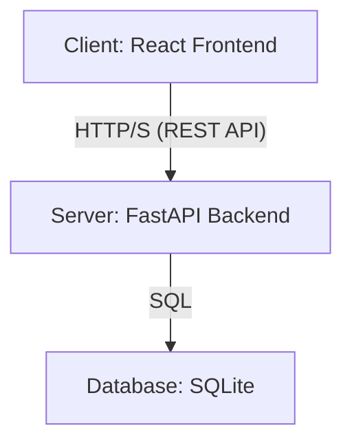

# Expense Tracker Architecture Document

This document provides a detailed overview of the architecture of the Expense Tracker application, including the frontend, backend, and data storage components.

## Table of Contents

- [1. Overview](#1-overview)
- [2. Overall Architecture](#2-overall-architecture)
- [3. Frontend Architecture](#3-frontend-architecture)
  - [3.1. Technology Stack](#31-technology-stack)
  - [3.2. Component Hierarchy](#32-component-hierarchy)
  - [3.3. Main Components](#33-main-components)
  - [3.4. Authentication Flow](#34-authentication-flow)
- [4. Backend Architecture](#4-backend-architecture)
  - [4.1. Technology Stack](#41-technology-stack)
  - [4.2. API Endpoints](#42-api-endpoints)
  - [4.3. Database Schema](#43-database-schema)
  - [4.4. Data Processing](#44-data-processing)
- [5. Data Migration](#5-data-migration)

## 1. Overview

The Expense Tracker is a web-based application designed to help users track their expenses and manage their personal finances. It consists of a React-based frontend for the user interface and a FastAPI-based backend for data processing and storage. The application supports managing multiple user profiles, tracking transactions, categorizing expenses, setting budgets, and managing financial assets. It also includes features for user authentication, premium subscriptions, and an admin panel for user and system management.

## 2. Overall Architecture

The application follows a classic client-server architecture.



-   **Client (Frontend)**: A single-page application (SPA) built with React. It is responsible for all user interactions and data visualization.
-   **Server (Backend)**: A Python application built with FastAPI. It exposes a RESTful API that the frontend consumes. It handles business logic, data processing, and database interactions.
-   **Database**: A SQLite database is used for persistent storage. It stores all user data, including profiles, transactions, categories, rules, and assets.

## 3. Frontend Architecture

The frontend is a single-page application (SPA) built with React. It is responsible for rendering the user interface, handling user interactions, and communicating with the backend API.

### 3.1. Technology Stack

-   **React**: A JavaScript library for building user interfaces (version 19.2.0).
-   **React Router**: A library for handling routing in React applications.
-   **React Bootstrap**: A library of pre-built components for React, based on the Bootstrap framework.
-   **Chart.js & Recharts**: Libraries for creating interactive charts and data visualizations.
-   **Axios**: A promise-based HTTP client for making requests to the backend API.
-   **react-datepicker**: A reusable date picker component for React.
-   **react-bootstrap-icons**: A library for popular Open Source icons.
-   **papaparse**: A CSV parser for the browser and Node.js.
-   **uuid**: For generating unique IDs.
-   **Custom CSS**: Used for global styling and UI/UX enhancements, including a custom color palette, modern typography, and dynamic component styling.

### 3.2. Component Hierarchy

The following diagram illustrates the main component hierarchy of the frontend application, including the new routing structure.

```mermaid
graph TD
    Router --> Routes;
    Routes --> LoginPage[Login Route];
    Routes --> SignupPage[Signup Route];
    Routes --> AdminRoute[Admin Route];
    Routes --> PrivateRoute;

    LoginPage --> LoginComponent[Login.js];
    SignupPage --> SignupComponent[Signup.js];
    AdminRoute --> AdminPanel[AdminPanel.js];

    PrivateRoute --> MainApp;

    MainApp --> SideBar;
    MainApp --> MainContent;
    MainApp --> SubscriptionModal;

    SideBar --> CreateProfileModal;
    SideBar --> EditProfileModal;
    SideBar --> ManageProfilesModal;

    MainContent --> Tabs;
    Tabs --> HomeTab[Home];
    Tabs --> ProfileDashboardTab[Profile Dashboard];
    Tabs --> RecordTransactionTab[Record Transaction];
    Tabs --> RecordAssetTab[Record Asset];
    Tabs --> RulesTab;
    Tabs --> SettingsTab;

    HomeTab --> HomePage;

    ProfileDashboardTab --> DashboardSubTabs;
    DashboardSubTabs --> OverviewTab;
    DashboardSubTabs --> SubcategoryTrendsTab;
    DashboardSubTabs --> TransactionDetailsTab;
    DashboardSubTabs --> BudgetTab;
    DashboardSubTabs --> AssetDashboard;

    OverviewTab --> SummaryCards;
    OverviewTab --> PaymentSourcePieChart;
    OverviewTab --> PaymentSourceMonthlyBarChart;
    OverviewTab --> MonthlySummaryTable;
    OverviewTab --> CategoryCostChart;
    OverviewTab --> MonthlyStackedBarChart;

    SubcategoryTrendsTab --> CategorySubcategoryMonthlyCharts;

    TransactionDetailsTab --> ExpenseTable;

    BudgetTab --> BudgetVisualization;

    AssetDashboard --> MonthlyAssetComparisonChart;
    AssetDashboard --> SubtypeDistributionChart;

    RecordTransactionTab --> ManualTransactionEntry[ManualTransactionEntry.js];
    RecordAssetTab --> RecordAsset[RecordAsset.js];

    RulesTab --> RulesTabComponent[RulesTab.js];
    SettingsTab --> SettingsComponent[Settings.js];
    SettingsTab --> AssetTypeManager[AssetTypeManager.js];
    SettingsTab --> PaymentSourceManager[PaymentSourceManager.js];

    AdminPanel --> AdminDashboardHome[AdminDashboardHome.js];
    AdminPanel --> PriceManagement[PriceManagement.js];
    AdminPanel --> DiscountManagement[DiscountManagement.js];
    AdminPanel --> ProposalQueue[ProposalQueue.js];
    AdminPanel --> LogDashboard[LogDashboard.js];
    AdminPanel --> TrialOfferManagement[TrialOfferManagement.js];
    AdminPanel --> WhitelistedUserRoleManagement[WhitelistedUserRoleManagement.js];
    AdminPanel --> MyProposals[MyProposals.js];
    AdminPanel --> ProposalForm[ProposalForm.js];
```



### 3.3. Main Components

-   **App.js**: The root component of the application. It sets up the routing structure (distinguishing between public, private, and admin routes) and contains the `MainApp` component, which manages the main state (profiles, transactions, settings) and the layout for authenticated users. It also handles dynamic tab rendering and feature gating based on user's premium status and active profile type. `axios` interceptors are configured here to automatically attach JWT for authentication and handle 401 errors.
-   **Login.js**: A public component that provides a form for users to log in.
-   **Signup.js**: A public component that provides a form for new users to register.
-   **AdminPanel.js**: A private component for users with the 'ADMIN' or 'MANAGER' role. It provides a navigation structure and routes to various admin sub-components, including `AdminDashboardHome`, `PriceManagement`, `DiscountManagement`, `ProposalQueue`, `LogDashboard`, `TrialOfferManagement`, `WhitelistedUserRoleManagement`, `MyProposals`, and `ProposalForm`.
-   **AdminDashboardHome.js**: Displays an overview of key metrics for administrators, including total users, active subscriptions (with breakdown), pending proposals, recent activities, user sign-ups by day, new subscriptions by day, expired subscriptions by day, and total revenue by day. Utilizes `recharts` for data visualization.
-   **PriceManagement.js**: Enables administrators to manage geographic pricing for subscriptions.
-   **DiscountManagement.js**: Allows administrators to create and manage discount codes.
-   **ProposalForm.js**: A component for managers to create new proposals for admin review.
-   **MyProposals.js**: Displays a list of proposals submitted by the current manager.
-   **ProposalQueue.js**: Shows a queue of pending proposals for administrators to review and approve/reject.
-   **LogDashboard.js**: Provides an interface for viewing and filtering user activity logs.
-   **TrialOfferManagement.js**: Allows administrators to configure the default free trial duration for new user sign-ups.
-   **WhitelistedUserRoleManagement.js**: Manages whitelisted users, displaying their details (First Name, Last Name, Email, Phone, Role) and allowing Admins to add/remove users from the whitelist and assign roles. Role changes require confirmation, and Admin/Manager users cannot be removed from the whitelist.
-   **authService.js**: A utility module that encapsulates the logic for handling authentication-related API calls (login, signup, logout) and managing the user's authentication token in local storage.
-   **SideBar.js**: Displays the list of user profiles, grouped by profile type (e.g., Expense Manager, Asset Manager) with corresponding icons. It allows users to create, edit, and delete profiles, and launches `UserProfileEditModal` and `ChangePasswordModal` for user account management. Features dynamic styling for profile types and compact design with icon-only buttons.
-   **HomePage.js**: The landing page of the application, providing an entry point for profile selection or creation.
-   **AssetDashboard.js**: The main dashboard for the "Asset Manager" profile type. It displays a summary of assets and includes charts for visualizing asset data.
-   **ManualTransactionEntry.js**: A form for manually adding new transactions.
-   **RecordAsset.js**: A form for recording new assets.
-   **ExpenseTable.js**: Displays a table of transactions with filtering and sorting capabilities.
-   **Settings.js**: Allows users to manage categories, subcategories, budgets, and payment sources for Expense Manager profiles through a tabbed interface ("Categories and Subcategories", "Budget Management", "Manage Payment Sources"). Includes advanced budget management features like overlap validation and copying budgets between years. Payment source management is delegated to `PaymentSourceManager`.
-   **AssetTypeManager.js**: Used within the Settings tab for Asset Manager profiles to manage asset types and their subtypes.
-   **PaymentSourceManager.js**: Used within the Settings tab for Expense Manager profiles to manage payment sources.
-   **RulesTab.js**: Provides an interface for creating and managing transaction categorization rules.
-   **MembershipBanner.js**: A banner displayed to non-premium users, prompting them to subscribe.
-   **SubscriptionModal.js**: A modal window that allows users to subscribe to a premium plan.
-   **Chart Components**: Various components for data visualization, such as `PaymentSourcePieChart`, `MonthlyStackedBarChart`, `CategoryCostChart`, etc.
-   **Activity Logging (Frontend)**: The `logActivity` function is extensively used across various frontend components to track user interactions and send them to the backend for auditing and analytics.

### 3.4. Authentication Flow

The authentication flow is designed to be secure and straightforward, using JWT (JSON Web Tokens) for authenticating users after the initial login. The frontend utilizes `axios` interceptors to automatically attach the JWT to outgoing requests and handle 401 Unauthorized errors by redirecting to the login page.

1.  **User Registration**:
    -   A new user fills out the registration form in the `Signup.js` component.
    -   The frontend sends a `POST` request to `/api/users/signup` with the user's details (email, password, name).
    -   The backend validates the data, hashes the password, and creates a new user in the database.
    -   Upon successful registration, the user is redirected to the login page.

2.  **User Login**:
    -   The user enters their credentials in the `Login.js` component.
    -   The frontend sends a `POST` request to `/api/users/login` with the user's email and password.
    -   The backend verifies the credentials. If they are correct, it generates a JWT access token.
    -   The backend returns the access token to the frontend.

3.  **Token Storage**:
    -   The frontend stores the received access token in the browser's local storage. This token is used to authenticate subsequent API requests.

4.  **Authenticated Requests**:
    -   For any request that requires authentication, the frontend includes the access token in the `Authorization` header of the HTTP request (e.g., `Authorization: Bearer <token>`).
    -   The backend uses dependency functions from `auth.py` (e.g., `get_current_active_user`, `get_current_admin_user`, `get_current_manager_user`) to verify the token from the request header and enforce role-based access control.
    -   If the token is valid and the user has the required role, the backend proceeds with the request. If not, it returns a `401 Unauthorized` or `403 Forbidden` error.

5.  **Logout**:
    -   When the user logs out, the frontend removes the access token from local storage.
    -   This effectively ends the user's session, and they will need to log in again to access private routes.

## 4. Backend Architecture

The backend is a Python application built with the FastAPI framework. It provides a RESTful API for the frontend, manages the database, and handles all business logic.

### 4.1. Technology Stack

-   **FastAPI**: A modern, fast (high-performance) web framework for building APIs with Python 3.7+ based on standard Python type hints.
-   **SQLModel**: A library for interacting with SQL databases from Python code, with Python objects. It is designed to be compatible with FastAPI and Pydantic.
-   **Uvicorn**: An ASGI server for running the FastAPI application.
-   **Pandas**: A powerful data analysis and manipulation library, used for some data processing tasks.
-   **python-dotenv**: A library for managing environment variables.
-   **passlib**: A library for password hashing and verification.
-   **python-jose**: A library for encoding and decoding JSON Web Tokens (JWT).
-   **SQLAlchemy**: Used for advanced database features like `UniqueConstraint`.

### 4.2. API Endpoints

The backend exposes a variety of RESTful API endpoints for managing profiles, transactions, assets, and settings. Pydantic models are extensively used for defining request and response bodies, ensuring clear API contracts and data validation. Here is a summary of the main endpoints:

#### User and Authentication
-   **`POST /api/users/signup`**: Register a new user.
-   **`POST /api/users/login`**: Authenticate a user and get an access token.
-   **`GET /api/users/me`**: Get the details of the currently authenticated user.
-   **`PUT /api/users/me`**: Update the details of the currently authenticated user.
-   **`PUT /api/users/me/password`**: Change the password for the currently authenticated user.
-   **`POST /api/users/me/subscribe`**: Subscribe the user to a premium plan (simulated payment).
-   **`GET /api/users/me/subscription_history`**: Get the subscription history for the current user.

#### Profiles
-   **`POST /api/profiles`**: Create a new profile for the current user.
-   **`GET /api/profiles`**: Get all profiles for the current user, with an option to include hidden profiles.
-   **`GET /api/profiles/{profile_id}`**: Get a specific profile by ID.
-   **`PUT /api/profiles/{profile_id}`**: Update a specific profile (e.g., name, currency, visibility, type).
-   **`DELETE /api/profiles/{profile_id}`**: Delete a specific profile.

#### Payment Sources
-   **`POST /api/payment_sources`**: Create a new payment source. The `source_name` is automatically converted to uppercase and spaces are replaced with underscores.
-   **`GET /api/profiles/{profile_id}/payment_sources`**: Get all payment sources for a profile.
-   **`DELETE /api/payment_sources/{payment_source_id}`**: Delete a payment source.

#### Transactions
-   **`POST /api/transactions`**: Create a single transaction.
-   **`POST /api/transactions/bulk`**: Create multiple transactions in a single request.
-   **`DELETE /api/transactions/{transaction_id}`**: Delete a transaction.

#### Expenses and Financial Analysis
-   **`GET /api/expenses`**: Get all income and expense transactions for a profile, with categorization applied by the Rule Engine.
-   **`GET /api/category_costs`**: Get the total cost for each expense category.
-   **`GET /api/monthly_category_expenses`**: Get monthly expenses per category.
-   **`GET /api/budget_vs_expenses`**: Get a comparison of budget vs. expenses over a specified period, supporting various time granularities.

#### Assets
-   **`POST /api/asset_types`**: Create a new asset type.
-   **`GET /api/profiles/{profile_id}/asset_types`**: Get all asset types for a profile.
-   **`PUT /api/asset_types/{asset_type_id}`**: Update an asset type.
-   **`DELETE /api/asset_types/{asset_type_id}`**: Delete an asset type.
-   **`POST /api/assets`**: Create or update assets in bulk. This endpoint handles upsert-like behavior, updating existing assets if a unique combination (profile_id, date, asset_type_id, asset_subtype_name) is found, or creating new ones otherwise.
-   **`GET /api/profiles/{profile_id}/assets`**: Get all assets for a profile, with optional filtering by year and asset type.
-   **`GET /api/profiles/{profile_id}/assets/summary`**: Get a summary of assets for a profile, including total portfolio value and value per asset type.
-   **`GET /api/profiles/{profile_id}/assets/total_latest_value`**: Get the total latest value of all assets, intelligently determining the most recent entry for each asset based on date and ID.
-   **`GET /api/profiles/{profile_id}/assets/monthly_summary`**: Get a monthly summary of asset values.
-   **`PUT /api/assets/{asset_id}`**: Update a specific asset.
-   **`DELETE /api/assets/{asset_id}`**: Delete a specific asset.

#### Settings
-   **`POST /api/settings`**: Update the settings for a profile (categories, rules, budgets).

#### Activity Logging
-   **`POST /api/log_activity`**: Log a generic user activity from the frontend.
-   **`GET /api/admin/activity/recent`**: Get recent user activities (admin only).
-   **`GET /api/admin/activity/logs`**: Get user activity logs with filtering and grouping options (admin only).

#### Admin
-   **`POST /api/admin/users/{user_id}/assign-role`**: Assign a role to a user.
-   **`GET /api/admin/users`**: Get a list of all users.
-   **`GET /api/admin/users/count`**: Get the total count of registered users.
-   **`GET /api/admin/subscriptions/count`**: Get the count and breakdown of active subscriptions.
-   **`GET /api/admin/proposals/count`**: Get the count of pending proposals.
-   **`GET /api/admin/user-signups-by-day`**: Get user signup data grouped by day for a specified period.
-   **`GET /api/admin/new-subscriptions-by-day`**: Get new subscription data grouped by day and type for a specified period.
-   **`GET /api/admin/expired-subscriptions-by-day`**: Get expired subscription data grouped by day and type for a specified period.
-   **`GET /api/admin/total-revenue-by-day`**: Get total revenue data grouped by day for a specified period.
-   **`GET /api/admin/settings/{key}`**: Retrieve a specific admin setting (e.g., `DEFAULT_TRIAL_DAYS`).
-   **`PUT /api/admin/settings/{key}`**: Update a specific admin setting.
-   **`POST /api/admin/pricing`**: Create a new geographic price.
-   **`GET /api/admin/pricing`**: Get all geographic prices.
-   **`PUT /api/admin/pricing/{price_id}`**: Update a geographic price.
-   **`POST /api/admin/discounts`**: Create a new discount.
-   **`GET /api/admin/discounts`**: Get all discounts.
-   **`PUT /api/admin/discounts/{discount_id}`**: Update a discount.
-   **`POST /api/admin/proposals/{proposal_id}/approve`**: Approve a proposal.
-   **`POST /api/admin/proposals/{proposal_id}/reject`**: Reject a proposal.
-   **`GET /api/admin/proposals`**: Get all proposals (for admin review).
-   **`POST /api/admin/whitelist/add`**: Add a user to the whitelist.
-   **`DELETE /api/admin/whitelist/remove/{user_id}`**: Remove a user from the whitelist.
-   **`GET /api/admin/whitelist`**: Retrieve all whitelisted users, including their details (First Name, Last Name, Email, Phone, Role) using the `WhitelistedUserResponse` model.

#### Manager
-   **`POST /api/manager/proposals`**: Create a new proposal.
-   **`GET /api/manager/proposals`**: Get all proposals created by the manager.
-   **`GET /api/manager/users/{user_id}`**: Get details of a specific user (accessible to managers).

#### Public Pricing and Discounts
-   **`GET /api/pricing`**: Get all public geographic prices.
-   **`GET /api/discounts`**: Get all public discounts.

### 4.3. Database Schema

The following diagram illustrates the database schema. Note that the `on_startup` function in `main.py` handles dynamic schema migrations, adding columns like `user_first_name`, `user_last_name`, `subscription_expiry_date`, `role` to `User`, `public_id`, `is_hidden`, `profile_type` to `Profile`, and `profile_id` to `UserActivity` if they don't exist.

```mermaid
erDiagram
    USER ||--o{ PROFILE : has
    USER ||--o{ SUBSCRIPTION_HISTORY : has
    USER ||--o{ PAYMENT_TRANSACTION : has
    USER ||--o{ PROPOSAL : "proposed by"
    USER ||--o{ PROPOSAL : "reviewed by"
    USER ||--o{ USER_ACTIVITY : "logs"
    PROFILE ||--o{ TRANSACTION : has
    PROFILE ||--o{ CATEGORY : has
    PROFILE ||--o{ RULE : has
    PROFILE ||--o{ BUDGET : has
    PROFILE ||--o{ PAYMENT_SOURCE : has
    PROFILE ||--o{ ASSET_TYPE : has
    PROFILE ||--o{ ASSET : has
    ASSET_TYPE ||--o{ ASSET : "is of type"
    PROPOSAL ||--o{ PROPOSAL_TARGET : has
    SUBSCRIPTION_HISTORY ||--o{ PAYMENT_TRANSACTION : "related to"

    USER {
        int id PK
        string email
        string hashed_password
        string user_first_name
        string user_last_name
        string mobile_phone_number
        string country_code "ISO 3166-1 alpha-2 country code derived from IP address"
        datetime subscription_expiry_date
        string role
        datetime account_creation_time
        datetime account_updated_time
    }

    PROFILE {
        int id PK
        string public_id "Unique identifier for public sharing"
        string name
        string currency
        bool is_hidden "Indicates if the profile should be hidden from general view"
        string profile_type "Type of profile: EXPENSE_MANAGER or ASSET_MANAGER"
        int user_id FK
    }

    TRANSACTION {
        int id PK
        string date
        string description
        float amount
        string payment_source
        string category
        string subcategory
        int profile_id FK
    }

    CATEGORY {
        int id PK
        string name
        string subcategories
        int profile_id FK
    }

    RULE {
        int id PK
        string category
        string subcategory
        string logical_operator
        string conditions
        int profile_id FK
    }

    BUDGET {
        int id PK
        string category
        float amount
        int year
        string months
        int profile_id FK
    }

    PAYMENT_SOURCE {
        int id PK
        int profile_id FK
        string payment_type
        string source_name
        string note
        UNIQUE(profile_id, source_name)
    }

    ASSET_TYPE {
        string id PK
        string name
        string subtypes
        int profile_id FK
        UNIQUE(profile_id, name)
        UNIQUE(profile_id, name, subtypes)
    }

    ASSET {
        int id PK
        string date
        string asset_type_id FK
        string asset_type_name
        string asset_subtype_name
        float value
        string note
        int profile_id FK
    }

    SUBSCRIPTION_HISTORY {
        int id PK
        int user_id FK
        string subscription_type
        datetime purchase_date
        datetime start_date
        datetime end_date
    }

    PAYMENT_TRANSACTION {
        int id PK
        int user_id FK
        int subscription_id FK
        float amount
        string currency
        string status
        string payment_gateway
        string gateway_transaction_id
        datetime transaction_date
    }

    GEOGRAPHIC_PRICE {
        int id PK
        string country_code
        string subscription_type
        float price
        string currency
    }

    DISCOUNT {
        int id PK
        string name
        float discount_percentage
        datetime start_date
        datetime end_date
        bool is_active
    }

    PROPOSAL {
        int id PK
        int proposer_id FK
        int reviewed_by_id FK
        string status
        string proposal_type
        json payload
        string rejection_reason
        datetime created_at
        datetime reviewed_at
    }

    PROPOSAL_TARGET {
        int id PK
        int proposal_id FK
        string target_type
        string target_value
    }

    USER_ACTIVITY {
        int id PK
        int user_id FK
        int profile_id FK
        string activity_type "Extensive enum covering various user and admin actions"
        datetime timestamp
        string ip_address
        string country_code "ISO 3166-1 alpha-2 country code derived from IP address"
    }

    ADMIN_SETTING {
        string key PK "Unique key for the setting"
        string value "Value of the setting"
    }

    WHITELISTED_USER {
        int id PK
        int user_id FK "Foreign key to the User table"
        datetime added_at "Timestamp when the user was whitelisted"
    }
```

### 4.4. Data Processing

### 4.4. Data Processing

-   **Authentication (`auth.py`)**: This module handles all authentication-related logic. It uses `passlib` with the `bcrypt` algorithm for password hashing and `python-jose` for creating and verifying JWT tokens. It provides functions to create users, verify passwords, and get the current authenticated user from a token.
-   **Rule Engine (`rule_engine.py`)**: This component is responsible for categorizing transactions based on a set of user-defined rules. It supports various fields (e.g., "Date", "Payment Source", "Description"), rule types (e.g., "contains", "equal", "range"), and logical operators ("AND", "OR"). It also handles backward compatibility for older rule formats. When new transactions are fetched, the rule engine applies the rules to automatically assign a category and subcategory to each transaction.
-   **Data Aggregation**: The backend performs various data aggregations on the fly to provide data for the frontend charts. For example, it calculates monthly expenses per category, total asset values, and budget vs. expense comparisons.
-   **Activity Logging**: The system logs various user activities for analytics and auditing purposes. The `log_activity` function is used throughout the backend to record events such as user login, profile creation, transaction recording, asset management, and administrative actions. The `ActivityType` enum provides a comprehensive list of trackable events. The `/api/log_activity` endpoint allows the frontend to log generic user activities. User's `country_code` is also captured during activity logging using the `_get_country_code_from_ip` helper function.
-   **Geolocation (`_get_country_code_from_ip`)**: A helper function used to determine a user's country code based on their IP address. In a production environment, this would integrate with a robust GeoIP database or API service.

## 5. Data Migration

The application includes a data migration script, `src/backend/migrate_data.py`, which is responsible for migrating data from older formats (CSV and JSON) into the SQLite database.

This script is intended to be run once during the initial setup of the application. It reads data from `consolidated_expenses.csv` and `user_settings.json` and populates the database with the initial set of users, profiles, transactions, and settings. This ensures a smooth transition for users who were using a previous version of the application that stored data in flat files.
