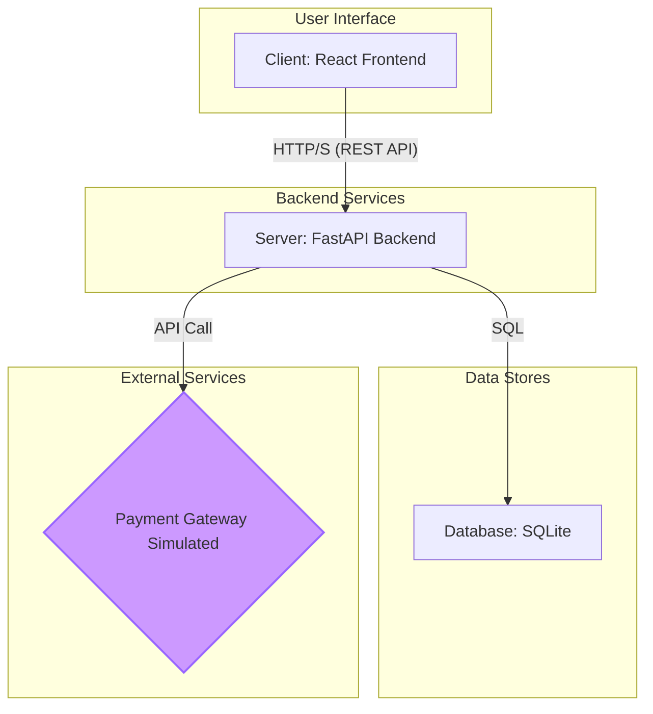
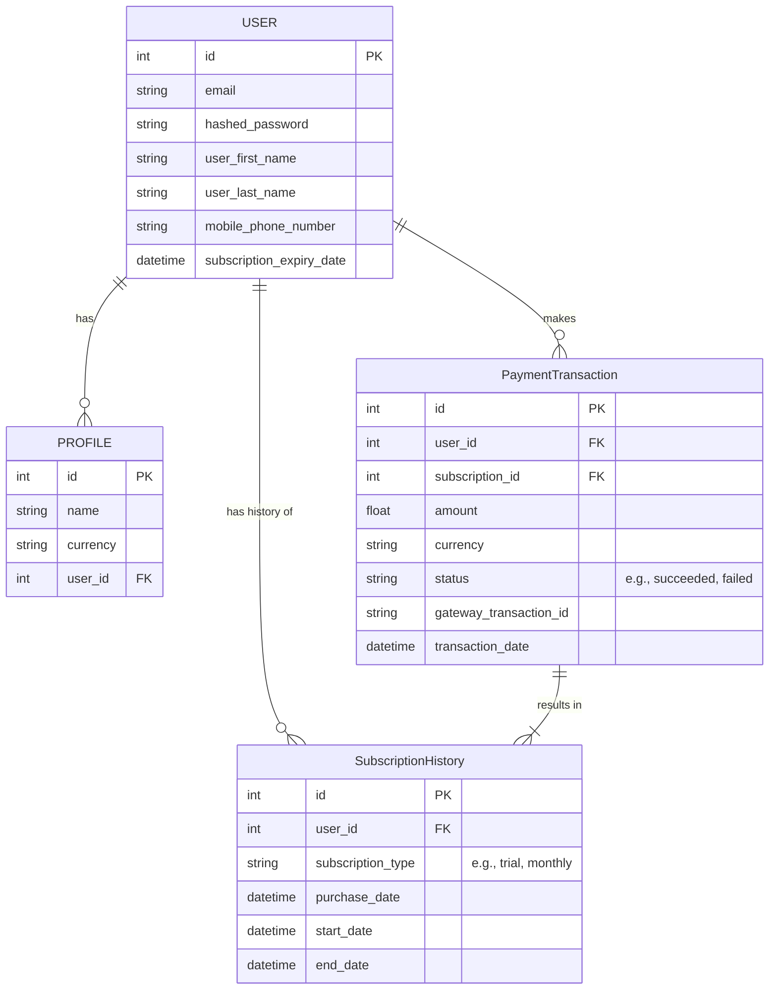
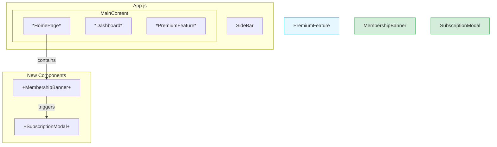
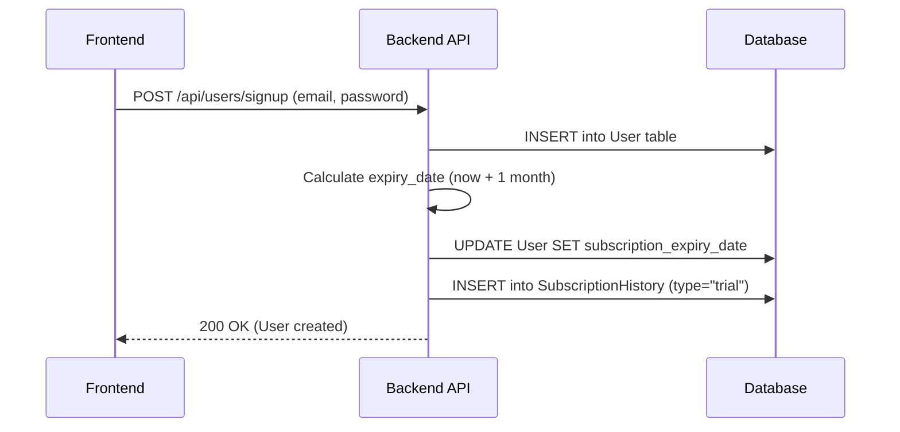
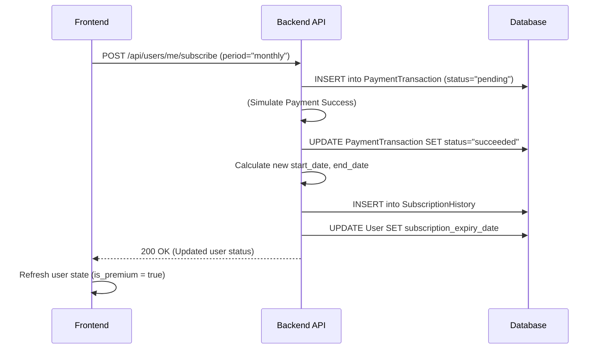
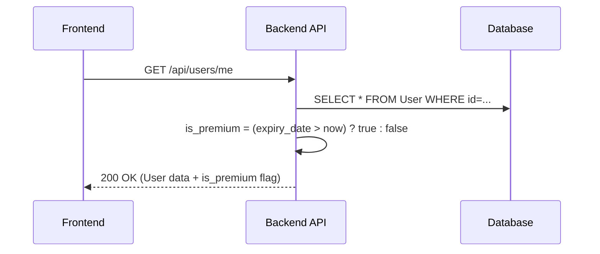

# **Premium Membership Feature: Design Document**

## 1. Overview

This document outlines the technical design for implementing a premium membership system within the Expense Tracker application. The objective is to create two user tiers ("Premium" and "Free"), control access to certain features, and provide a seamless workflow for users to manage their subscription status. The system is designed to be robust, scalable, and to ensure no user data is ever lost due to a change in subscription status.

## 2. Core Requirements

-   **User Tiers:** The system will support "Premium" and "Free" user tiers.
-   **Default Trial:** New users will automatically receive a 1-month premium trial.
-   **Subscription Management:** Free users will be able to purchase monthly or yearly subscriptions. The system will handle subscription expirations and renewals.
-   **Access Control:** Premium features will be locked for Free users.
-   **User Interface:** A persistent banner will prompt Free users to upgrade, leading to a subscription modal.
-   **History Tracking:** All subscription and payment transaction details will be stored historically.
-   **Data Persistence:** A user's application data (transactions, profiles, etc.) will be preserved regardless of their subscription status.

## 3. Proposed Architecture

This section details the proposed architectural changes, including database schema, API endpoints, and frontend components.

### 3.1. Legend for Changes

-   <span style="color: #28a745;">**[+] Green / Bold**</span>: Represents a new component, table, or endpoint.
-   <span style="color: #007bff;">*[*] Blue / Italic*</span>: Represents a modified component or an existing element with new logic.

### 3.2. Overall Architecture Diagram

The high-level architecture remains a client-server model, with the addition of a (simulated) payment processing flow.



### 3.3. Database Schema (Proposed)

We will add **one new column** to the `USER` table and introduce **two new tables**: `SubscriptionHistory` and `PaymentTransaction`.



### 3.4. Backend API Endpoints

| Status | Method | Endpoint | Description |
| :--- | :--- | :--- | :--- |
| *[MODIFIED]* | `POST` | `/api/users/signup` | Creates a new user and sets up their 1-month premium trial. |
| *[MODIFIED]* | `GET` | `/api/users/me` | Returns user details, now including `is_premium` and `subscription_expiry_date`. |
| **[NEW]** | `POST` | `/api/users/me/subscribe` | Handles a new subscription purchase, updating user status and creating historical records. |
| **[NEW]** | `GET` | `/api/users/me/subscription_history`| Returns a list of all past and present subscriptions for the user. |

### 3.5. Frontend Component Architecture

New components will be added to handle the user-facing aspects of the membership feature.



## 4. Detailed Implementation Plan

### 4.1. Database Layer (`src/backend/models.py`)

```diff
--- a/src/backend/models.py
+++ b/src/backend/models.py
@@ -1,5 +1,6 @@
 from typing import List, Optional
 from enum import Enum
+from datetime import datetime
 import uuid

 from sqlmodel import Field, Relationship, SQLModel
@@ -17,6 +18,7 @@
     user_first_name: Optional[str] = None
     user_last_name: Optional[str] = None
     mobile_phone_number: Optional[str] = None
+    subscription_expiry_date: Optional[datetime] = Field(default=None)

     profiles: List["Profile"] = Relationship(back_populates="user")

+class SubscriptionHistory(SQLModel, table=True):
+    id: Optional[int] = Field(default=None, primary_key=True)
+    user_id: int = Field(foreign_key="user.id")
+    subscription_type: str
+    purchase_date: datetime
+    start_date: datetime
+    end_date: datetime
+
+class PaymentTransaction(SQLModel, table=True):
+    id: Optional[int] = Field(default=None, primary_key=True)
+    user_id: int = Field(foreign_key="user.id")
+    subscription_id: Optional[int] = Field(foreign_key="subscriptionhistory.id")
+    amount: float
+    currency: str
+    status: str
+    payment_gateway: str = "simulated"
+    gateway_transaction_id: Optional[str] = Field(default=None, index=True)
+    transaction_date: datetime

```

### 4.2. Backend Layer (`src/backend/main.py`)

-   **User Signup (`/api/users/signup`):**
    1.  After creating the `User`, calculate an expiry date 1 month in the future.
    2.  Update the `user.subscription_expiry_date`.
    3.  Create a new `SubscriptionHistory` record with `subscription_type: "trial"`.
    4.  Commit all changes to the database.

-   **User Status Check (`/api/users/me`):**
    1.  Fetch the `current_user`.
    2.  Calculate `is_premium = user.subscription_expiry_date > datetime.now()`.
    3.  Return the user object along with the `is_premium` flag and the `subscription_expiry_date`.

-   **Subscription Purchase (`/api/users/me/subscribe`):**
    1.  Create a `PaymentTransaction` record with `status: "pending"`.
    2.  (Simulate payment processing).
    3.  Update the `PaymentTransaction` status to `"succeeded"`.
    4.  Calculate the new expiry date (adding to the current date if expired, or to the existing expiry date if renewing).
    5.  Create a `SubscriptionHistory` record with the new dates and type (`"monthly"`/`"yearly"`).
    6.  Update the `PaymentTransaction` with the new `subscription_id`.
    7.  Update the `user.subscription_expiry_date` in the database.

### 4.3. Frontend Layer (`src/frontend/expense-visualizer/src/`)

-   **Auth/User Context:** Store `is_premium` and `subscription_expiry_date` globally.
-   **`MembershipBanner.js`:** A new component that is conditionally rendered at the top of the app if `is_premium` is `false`. It will contain a call-to-action button.
-   **`SubscriptionModal.js`:** A new modal component, opened by the banner. It will contain buttons for monthly/yearly subscriptions that call the `/api/users/me/subscribe` endpoint.
-   **Feature Locking:** Existing components for premium features will be wrapped in a conditional check: `{isPremium ? <PremiumFeature /> : <LockedView />}`.

## 5. Key Workflows (Sequence Diagrams)

### 5.1. New User Registration (Trial Flow)



### 5.2. Free User Upgrading to Premium



### 5.3. User Status Check (API Request Flow)



## 6. Data Management & Safety

A user's subscription status is completely decoupled from their core application data (profiles, transactions, assets, etc.). If a user's premium subscription lapses, they will lose access to premium features, but their data will remain intact and will be fully available again upon re-subscription. This design ensures data integrity and a positive user experience.
