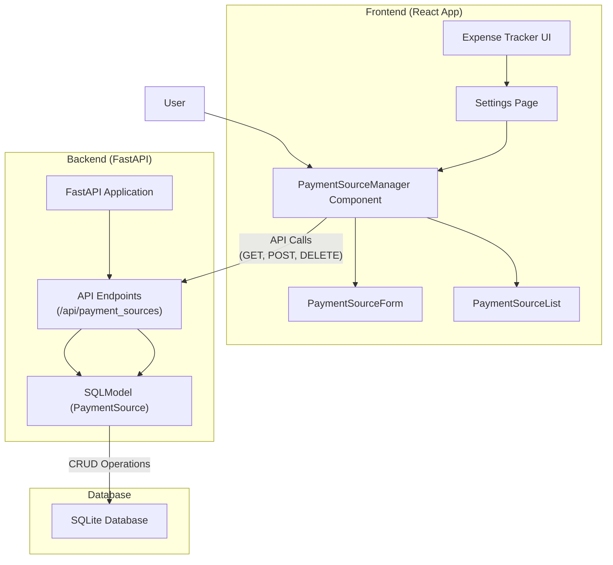

# Low-Level Design: Payment Source Management

## 1. Introduction

This document outlines the low-level design for integrating Payment Source management into the Expense Tracker UI. This feature will allow users to define and manage various payment methods (e.g., credit cards, bank accounts) they use for transactions. These payment sources will be associated with a user's profile and can be used for categorization and filtering of expenses.

## 2. Database Schema

A new table, `payment_source`, will be introduced to store the details of each payment method.

### `PaymentSource` Model (`src/backend/models.py`)

```python
from typing import Optional, List
from sqlmodel import Field, SQLModel, Relationship
from enum import Enum

class PaymentType(str, Enum):
    CREDIT_CARD = "Credit Card"
    DEBIT_CARD = "Debit Card"
    ONLINE_BANKING = "Online Banking"
    CASH = "Cash" # Added Cash as a common payment type
    OTHER = "Other" # Added Other for flexibility

class PaymentSource(SQLModel, table=True):
    id: Optional[int] = Field(default=None, primary_key=True)
    profile_id: int = Field(foreign_key="profile.id", index=True)
    payment_type: PaymentType = Field(default=PaymentType.OTHER)
    source_name: str = Field(index=True) # e.g., "Visa ending in 1234", "My Bank Account"
    note: Optional[str] = None

    # Relationship to Profile
    profile: "Profile" = Relationship(back_populates="payment_sources")

    class Config:
        # Ensure uniqueness for profile_id and source_name
        unique_together = [("profile_id", "source_name")]
```

**Note:** The `Profile` model will need to be updated to include a `payment_sources` relationship.

```python
# Existing Profile model in src/backend/models.py will be updated
# ...
class Profile(SQLModel, table=True):
    # ... existing fields ...
    payment_sources: List["PaymentSource"] = Relationship(back_populates="profile")
    # ...
```

## 3. Backend API Endpoints

The following RESTful API endpoints will be added to `src/backend/main.py` to manage `PaymentSource` entities.

### `POST /api/payment_sources`

*   **Description**: Creates a new payment source for the current user's profile.
*   **Request Body**: `PaymentSource` object (excluding `id`).
*   **Response**: The created `PaymentSource` object, including its generated `id`.
*   **Error Handling**: Returns `400 Bad Request` if `profile_id` is missing or invalid, or if a payment source with the same `source_name` already exists for the given `profile_id`.

### `GET /api/payment_sources/{profile_id}`

*   **Description**: Retrieves all payment sources associated with a specific `profile_id`.
*   **Response**: A list of `PaymentSource` objects.
*   **Error Handling**: Returns `404 Not Found` if the `profile_id` does not exist.

### `DELETE /api/payment_sources/{payment_source_id}`

*   **Description**: Deletes a payment source by its `id`.
*   **Response**: `204 No Content` on successful deletion.
*   **Error Handling**: Returns `404 Not Found` if the `payment_source_id` does not exist.

## 4. Frontend Components

The frontend will be updated to include a new section in the `Settings.js` page.

### `src/frontend/expense-visualizer/src/Settings.js`

*   **Integration**: A new tab or section will be added to `Settings.js` to house the Payment Source management UI.
*   **State Management**: `Settings.js` will manage the list of payment sources for the currently active profile.

### New Component: `src/frontend/expense-visualizer/src/components/PaymentSourceManager.js` (or similar)

This component will encapsulate the UI and logic for managing payment sources.

*   **`PaymentSourceForm` Sub-component**:
    *   **Fields**:
        *   `Payment Type`: A dropdown (`<select>`) with options from `PaymentType` enum (e.g., "Credit Card", "Debit Card", "Online Banking", "Cash", "Other").
        *   `Payment Source`: A text input for the name (e.g., "Visa ending in 1234").
        *   `Note`: A textarea for optional notes.
    *   **Actions**: "Add Payment Source" button.
    *   **Validation**: Client-side validation to ensure required fields are filled.
*   **`PaymentSourceList` Sub-component**:
    *   **Display**: A table or list showing existing payment sources (Payment Type, Source Name, Note).
    *   **Actions**: "Delete" button for each payment source. (An "Edit" button can be added in the future).

## 5. Frontend Logic

### `PaymentSourceManager.js` (or `Settings.js` if integrated directly)

*   **Data Fetching**: On component mount (or when the profile changes), fetch all payment sources for the active `profile_id` using `GET /api/payment_sources/{profile_id}`.
*   **Adding a Payment Source**:
    1.  Collect data from the `PaymentSourceForm`.
    2.  Send a `POST` request to `/api/payment_sources`.
    3.  On success, update the local state to reflect the new payment source and clear the form.
    4.  Handle errors (e.g., display a toast notification for duplicate names).
*   **Deleting a Payment Source**:
    1.  Confirm deletion with the user (e.g., using `ConfirmationModal.js`).
    2.  Send a `DELETE` request to `/api/payment_sources/{payment_source_id}`.
    3.  On success, remove the payment source from the local state.
    4.  Handle errors.

## 6. Architecture Diagram



## 7. Open Questions (Reiterated for clarity) 

1.  **Default Payment Source:** How should the "Default" payment type behave? Should there only be one default per profile? If so, how should the system handle setting a new default (i.e., unsetting the previous one)? (Currently assumed no special handling).
2.  **Initial Data:** Will there be any initial payment source data that needs to be migrated? If so, what format will it be in? (Currently assumed no initial migration).
